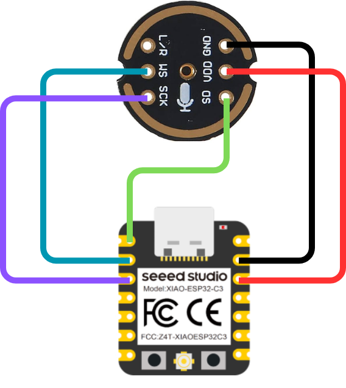

# m_tinyml

## Configuración
Estos son los comandos necesarios para configurar Espressif IDF, una biblioteca que nos permite crear proyectos y flashear firmware para el ESP32.
Comandos: 
```
mkdir -p ~/esp
cd ~/esp
git clone --recursive https://github.com/espressif/esp-idf.git
cd ~/esp/esp-idf
./install.sh esp32c3, esp32s3
. ./export.sh
```

Con estos comandos se puede utilizar el comando `idf.py` para compilar código y flashear el ESP32.

## Compilar y flashear
Para compilar y flashear un proyecto se puede utilizar el comando `idf.py` con las siguientes opciones:
```
idf.py build
idf.py -p /dev/ttyUSB0 flash monitor
```

## Archivos relevantes
- **audio_provider**: Contiene la inicializacion y configuración del micrófono utilizando el protocolo I2S.
- **micro_features_generator.cc**: Contiene las funciones encargadas de realizar las fft y el procesamiento adicional para obtener el espectrograma del audio.
- **main_functions.cc**: Contiene las funciones de **setup** y **loop** del programa.
    - **setup**: Inicializa el micrófono y el carga el modelo de tflite al interprete.
    - **loop**: 
        - Obtiene datos del micrófono.
        - Procesa los datos para obtener el espectrograma.
        - Realiza la inferencia con **interpreter->Invoke()**.
        - Calcula el argumento con el valor más alto obtenido por la ultima capa de la red (Softmax).
- **model.cc**: Contiene toda la información referente a las operaciones y a los parámetros de la red neuronal.


## Diagrama de conexiones
Para conectar el micrófono INMP441 al ESP32 se debe especificar lo siguiente en **audio_provider**:
```
#if CONFIG_IDF_TARGET_ESP32S3
i2s_pin_config_t pin_config = {
    .bck_io_num = 3,    // Serial Clock (SCK)
    .ws_io_num = 2,     // Word Select (WS)
    .data_out_num = -1, // Not used
    .data_in_num = 1    // Serial Data (SD)
};
  i2s_config.bits_per_sample = (i2s_bits_per_sample_t) 32;
#else
  i2s_pin_config_t pin_config = {
      .bck_io_num = 4,    // IIS_SCLK
      .ws_io_num = 3,     // IIS_LCLK
      .data_out_num = -1,  // IIS_DSIN
      .data_in_num = 2,   // IIS_DOUT
  };
#endif
```

El siguiente diagrama muestra la conexión del micrófono INMP441 al ESP32:


